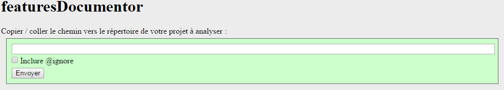

# featuresDocumentor
A tool to export functionalities from source code.

Objective : keep the description of functionalities closed to the source code - so you don't forget one - and export a complete list of them.

## Install
Clone this repository in your Web serveur document root (htdocs).

## Usage
First, add the following tags in DocBlock comments of your source code :

* @featuresCategories
* @featureCategories
* @feature

Exemple :
```php
/**
 * @featureCategories Main Foo/Small Foo/Tiny Foo
 * @feature Display Foo results
 */
```

Then, access to the home page of featuresDocumentor tools : http://localhost/[yourFolderNameHere]/
[yourFolderNameHere] has to be replace with the folder name where you clone this repository.
Follow the instructions.



## Reference

### @featuresCategories
Used to group all features of the file in categories and eventually sub categories.
Only one per file, in the header comment block for exemple.

### @featureCategorie
Used to group a feature in categories and eventually sub categories.
Use this tag with the @feature tag.

### @feature
Used to describe a fonctionality of your application.
You can use this tag as many as you want.

## Rendering
featuresDocumentor give you HTML rendering that can be copy-paste where you want.